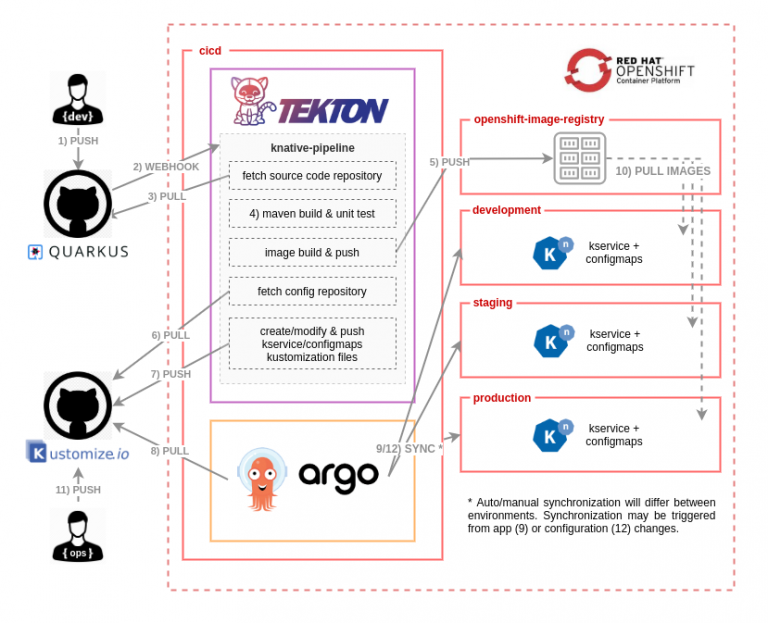

# GitOps with Tekton and ArgoCD

This project aims to create infrastructure for serverless applications with GitOps pratices. Playbooks install Operators and then create their basic components. After starting a pipeline project build and push images to registry. Then ArgoCD checks for synchronization of development, staging and production environments with Kustomize. If anything changes, Tekton notice that change and create new images. ArgoCD keeps syncing environments. 

## Technologies

* OpenShift
* Ansible
* Knative
* Helm
* Tekton
* ArgoCD
* Kustomize
* Quarkus

## Requirements

* OpenShift
* Ansible

## Pipeline Tasks

## Initial configuration

Install Kubernetes modules.

    ansible-galaxy collection install community.kubernetes
    
Login to your OpenShift cluster

    oc login --token={your-users-token} --server={server-domain}:{server-port}
    
Change GitHub credentials at **roles/tekton/templates/github.credentials**

    apiVersion: v1
    kind: Secret
    metadata:
      name: github-credentials
      annotations:
        tekton.dev/git-0: https://github.com
    type: kubernetes.io/basic-auth
    stringData:
      username: fatihkc
      password: {your-github-password}

## Start Ansible playbooks

Firstly, start your tekton playbook for initial configuration.
    
    ansible-playbook tekton.yaml -v
    
Start pipeline with your variables

    cat tekton/pipelines/knative-pipeline-run.yaml | \
      SOURCE_REPO=https://github.com/fatihkc/quarkus-hello-world.git \
      COMMIT=9ce90240f96a9906b59225fec16d830ab4f3fe12 \
      SHORT_COMMIT=9ce9024 \
      DEPLOYMENT_REPO=https://github.com/fatihkc/pipeline-test.git \
      IMAGES_NS=cicd envsubst | \
      oc create -f - -n cicd

Check your pipeline tasks. If everything looks fine then start ArgoCD pipeline.

    ansible-playbook argo.yaml -v
    
Get your route for accessing ArgoCD. Use your OpenShift credentials for access. This can take a while.
    
    oc get routes argocd-server -n cicd
    
Now you need to see your deployments. Start developing your application!

This project is based on David Sancho Ruiz's project. You can find original repository [here](https://github.com/dsanchor/rh-developers-cicd). This project makes it automated and improved. My goal is making Quarkus serverless deployments automated and trying to show how we can improve our pipelines.